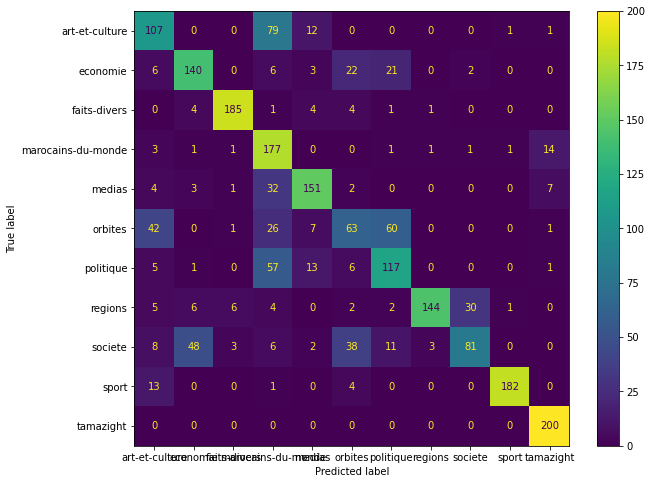

# Hespress Topic Classification


```python
import pandas as pd
import numpy as np
import re
from pathlib import Path
from matplotlib import pyplot as plt

DATAPATH = Path("Data")
STORIES_FILES = [
    'stories_art-et-culture.csv',
    'stories_economie.csv',
    'stories_faits-divers.csv',
    'stories_marocains-du-monde.csv',
    'stories_medias.csv',
    'stories_orbites.csv',
    'stories_politique.csv',
    'stories_regions.csv',
    'stories_societe.csv',
    'stories_sport.csv',
    'stories_tamazight.csv'
]
```

## Read Data


```python
dfs = []
for file in STORIES_FILES:
        df = pd.read_csv(DATAPATH / file, index_col=0)
        dfs.append(df)
stories_df = pd.concat(dfs, ignore_index=True)
```

## Data Processing


```python
def arabic_date_parser(date):
    morocian_months_mapper = {
        'يناير': 'January',
        'فبراير': 'February',
        'مارس': 'March',
        'أبريل': 'April',
        'ماي': 'May',
        'يونيو': 'June',
        'يوليوز': 'July',
        'غشت': 'August',
        'شتنبر': 'September',
        'أكتوبر': 'October',
        'نونبر': 'November',
        'دجنبر': 'December'
    }

    date_pattern = r'(السبت|الأحد|الاثنين|الثلاثاء|الأربعاء|الخميس|الجمعة)\s(?P<day>\d{2})\s+(?P<month>يناير|فبراير|مارس|أبريل|ماي|يونيو|يوليوز|غشت|شتنبر|أكتوبر|نونبر|دجنبر)\s+(?P<year>\d{4})\s+-\s+(?P<time>\d{2}:\d{2})'

    match = re.match(date_pattern, date)
    day = match.group('day')

    month = match.group('month')
    month = morocian_months_mapper[month]
    year = match.group('year')
    time = match.group('time')
    parsed_date = day + ' ' + month + ' ' + year + ' - ' + time
    return parsed_date
```


```python
stories_df["date"] = pd.to_datetime(stories_df["date"].apply(arabic_date_parser))
stories_df["day"] = stories_df["date"].dt.day.astype("category")
stories_df["month"] = stories_df["date"].dt.month.astype("category")
stories_df["year"] = stories_df["date"].dt.year.astype("category")

stories_df["author"] = stories_df["author"].astype("category")
```

## Data Split

Train and test split will be done such as test data should be the last 20% story from each topic, from the [EDA Notebook](https://github.com/moziada/WideBot-T2-Hespress-EDA) we know that each different topic has 1000 story and the data contains 11 different topics.


```python
train_idx = []
for i in range(11):
    start_idx = i * 1000
    end_idx = start_idx + 800
    train_idx.append(np.arange(start_idx, end_idx, 1))
train_idx = np.concatenate(train_idx)

test_idx = []
for i in range(11):
    start_idx = i * 1000 + 800
    end_idx = start_idx + 200
    test_idx.append(np.arange(start_idx, end_idx, 1))
test_idx = np.concatenate(test_idx)
```


```python
X_cols = ["author", "story", "day", "month", "year"]
y_col = "topic"

X_train = stories_df.loc[train_idx, X_cols]
y_train = stories_df.loc[train_idx, y_col]

X_test = stories_df.loc[test_idx, X_cols]
y_test = stories_df.loc[test_idx, y_col]
```

## Modeling


```python
from sklearn.feature_extraction.text import CountVectorizer
from sklearn.preprocessing import LabelEncoder

vectorizer = CountVectorizer(ngram_range=(2, 2), max_features=10000, token_pattern=r'[ء-ي]+').fit(X_train["story"])
target_encoder = LabelEncoder().fit(y_train)
```


```python
train_stories_vectorized = pd.DataFrame(vectorizer.transform(X_train["story"]).toarray(), index=train_idx)
X_train = pd.concat([X_train, train_stories_vectorized], axis=1).drop("story", axis=1)

test_stories_vectorized = pd.DataFrame(vectorizer.transform(X_test["story"]).toarray(), index=test_idx)
X_test = pd.concat([X_test, test_stories_vectorized], axis=1).drop("story", axis=1)

y_train = target_encoder.transform(y_train)
y_test = target_encoder.transform(y_test)
```


```python
import lightgbm as lgb

cat_features = ["day", "month", "year", "author"]
dtrain = lgb.Dataset(X_train, label=y_train, categorical_feature=cat_features)
dtest = lgb.Dataset(X_test, label=y_test, categorical_feature=cat_features)
```


```python
model_params = {
    "metrics": ['multi_logloss'],
    "verbosity": -1,
    "seed": 10,
    'objective': 'multiclass',
    'num_class': 11,
    #'max_depth': 4,
    #'min_split_gain': 0.2,
    #'num_leaves': 10,
    #'learning_rate': 0.2,
}

eval_callbacks = [lgb.early_stopping(50, verbose=1)]

clf = lgb.train(model_params,
                dtrain,
                num_boost_round=1500,
                categorical_feature=cat_features,
                valid_sets=[dtest],
                callbacks=eval_callbacks)
```

    [1]	valid_0's multi_logloss: 2.00822
    Training until validation scores don't improve for 50 rounds
    [2]	valid_0's multi_logloss: 1.82481
    [3]	valid_0's multi_logloss: 1.7143
    [4]	valid_0's multi_logloss: 1.61712
    [5]	valid_0's multi_logloss: 1.55085
    [6]	valid_0's multi_logloss: 1.50288
    [7]	valid_0's multi_logloss: 1.46954
    [8]	valid_0's multi_logloss: 1.43469
    [9]	valid_0's multi_logloss: 1.4091
    .
    .
    .
    [261]	valid_0's multi_logloss: 1.24969
    [262]	valid_0's multi_logloss: 1.24911
    [263]	valid_0's multi_logloss: 1.24972
    [264]	valid_0's multi_logloss: 1.2498
    [265]	valid_0's multi_logloss: 1.25119
    Early stopping, best iteration is:
    [215]	valid_0's multi_logloss: 1.22845
    


```python
y_pred = []
for y in clf.predict(X_test):
    y_pred.append(np.argmax(y))
```


```python
from sklearn.metrics import confusion_matrix, classification_report, ConfusionMatrixDisplay

print(classification_report(y_test ,y_pred, labels=[i for i in range(11)], target_names=target_encoder.inverse_transform([i for i in range(11)])))
```

                        precision    recall  f1-score   support
    
        art-et-culture       0.55      0.54      0.54       200
              economie       0.69      0.70      0.69       200
          faits-divers       0.94      0.93      0.93       200
    marocains-du-monde       0.46      0.89      0.60       200
                medias       0.79      0.76      0.77       200
               orbites       0.45      0.32      0.37       200
             politique       0.55      0.58      0.57       200
               regions       0.97      0.72      0.83       200
               societe       0.71      0.41      0.52       200
                 sport       0.98      0.91      0.95       200
             tamazight       0.89      1.00      0.94       200
    
              accuracy                           0.70      2200
             macro avg       0.72      0.70      0.70      2200
          weighted avg       0.72      0.70      0.70      2200
    
    

* **Precision**: measures the accuracy of correct classifications for a specific class in multiclass classification.
* **Recall**: measures the ability of the classifier to find all instances of a specific class.
* **F1-score**: penalizes classes that have either low precision or low recall, it gives equal weight to both metrics.
* **support**: number of examples per class.


```python
cm = confusion_matrix(y_test, y_pred)
cmd = ConfusionMatrixDisplay(confusion_matrix=cm, display_labels=target_encoder.classes_)

fig, ax = plt.subplots(figsize=(10, 8))
cmd.plot(ax=ax)

```




Some insights from the metrics, the overall accuracy is 70%, and there are classes that scores low accuracy like `orbites` that is usually misclassified as `politique` or `art-et-culture`
